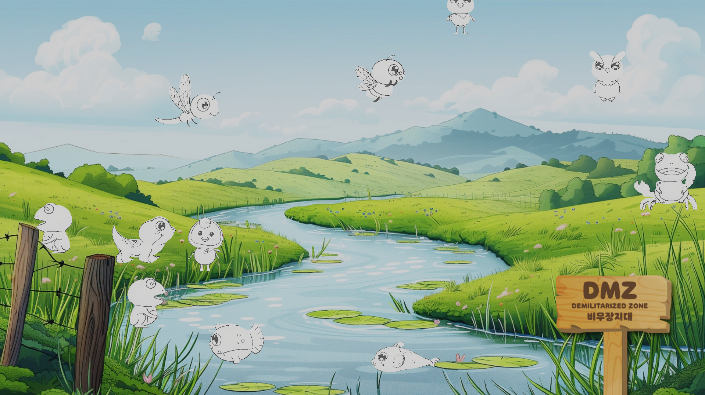

# Gyeonggi LiveSketch

경기도 DMZ 생물 라이브 스케치 프로젝트
색칠 도안을 스캔하면, 칠한 색상이 2D 캐릭터에 실시간으로 입혀져 화면 위를 배회합니다.



---

## 동작 원리

```
스캐너 → ScanFolderWatcher → QR 인식 → 이미지 보정 → 마커 검출 → 색상 추출 → 텍스처 합성 → 캐릭터 스폰
```

1. **ScanFolderWatcher** - 스캔 폴더를 감시하여 새 이미지 감지
2. **QRReader** - QR 코드를 읽어 동물 종류 식별 (zxing.dll)
3. **ImageOrientationCorrector** - QR 위치 기반으로 이미지 회전 보정
4. **CornerMarkerDetector** - 도안의 코너 마커 4점 검출 (적분 이미지 + 슬라이딩 윈도우)
5. **ColorExtractor** - 마커 영역 내 채색된 색상 추출
6. **ScanProcessor** - 베이스 아웃라인 + 스캔 색상을 합성하여 최종 텍스처 생성
7. **Model3DManager** - 캐릭터 스폰, 배회, 퇴장, 텍스처 적용 관리

---

## 등장 캐릭터 (11종)

| # | 이름 | QR 텍스트 | 프리팹 |
|---|------|-----------|--------|
| 1 | 수리부엉이 | 수리부엉이 | owl_Skeletal |
| 2 | 뜸부기 | 뜸부기 | ddumbugi_skeletal |
| 3 | 금개구리 | 금개구리 | Gaeguri_skeletal |
| 4 | 맹꽁이 | 맹꽁이 | Manggong_skeletal |
| 5 | 도룡뇽 | 도룡뇽 | Salamander_Skeletal_new |
| 6 | 꾸구리 | 꾸구리 | Kuguri_Skeletal |
| 7 | 어름치 | 어름치 | eorm_skeletal |
| 8 | 대모잠자리 | 대모잠자리 | Dragonfly_Skeletal2 |
| 9 | 늦반딧불이 | 늦반딧불이 | Lightbug_Skelatal |
| 10 | 말똥게 | 말똥게 | crab_Skelatal |
| 11 | 파랑이 | 파랑이 | parang_skeletal |

---

## 프로젝트 구조

```
Assets/
├── 01_Scenes/          씬 (SampleScene)
├── 02_Scripts/         C# 스크립트
│   ├── Animation/        XPingPong, ScalePulse, SpawnEffect, DespawnEffect 등
│   ├── Background/       BackgroundImageLoader (배경 슬라이드쇼)
│   ├── ColorExtractor/   색상 추출
│   ├── Debug/            SessionLogger
│   ├── ImageProcessor/   이미지 회전 보정
│   ├── MarkerDetector/   코너 마커 검출
│   ├── ModelManager/     Model3DManager, AnimalModelManager
│   ├── QRReader/         QR 코드 판독
│   ├── ScanFolderWatcher/ 폴더 감시
│   ├── ScanProcessor/    텍스처 합성
│   └── UI/               SpawnAnnouncementBanner (스폰 배너)
├── 03_Shaders/         쉐이더
│   ├── FrontProjection/  AnimatedColorProjection, FrontProjectionUnlit, BakedFrontUnlit
│   ├── PlanarProjection/ PlanarProjectionUnlit
│   └── TriplanarUnlitURP/ TriplanarUnlitURP, SideMirrorBlend
├── 04_Materias/        머티리얼
├── 05_Images/          이미지 리소스
│   ├── Background/       배경 이미지 (슬라이드쇼용)
│   ├── Character/        캐릭터 베이스 스프라이트
│   ├── Elec/             전기 이펙트
│   └── 라이브 캐릭터 문구/  스폰 배너 텍스트 이미지
├── 06_Models/          FBX 모델 (skeletal + animation)
├── 07_Animations/      애니메이션 클립 및 컨트롤러 (12종)
├── 08_Prefabs/         캐릭터 프리팹 (12개)
├── 09_Audios/          효과음 및 안내 음성 (25개)
├── Editor/             에디터 스크립트
├── Fonts/              폰트 (Godic)
├── Plugins/            zxing.dll (QR 라이브러리)
└── Settings/           URP 렌더링 설정
```

---

## 주요 기능

### 스폰 시스템
- QR 스캔 시 자동 스폰 + 수동 스폰 지원
- 스폰 이펙트 (파티클 응축 → 등장)
- 퇴장 이펙트 (DespawnEffect)
- 겹침 방지 구역 (소프트 회피)

### 배회
- 캐릭터별 개인 배회 범위 설정
- 이동 속도, 대기 시간 개별 조정
- 좌우 방향 자동 전환 (disableFlip으로 비활성화 가능)

### 색상 투영
- **UV 모드**: 기존 UV 매핑
- **Front Projection**: 정면 투영 (왜곡 없음)
- **BakedFront**: GPU 스키닝 기반 UV 베이킹
- **AnimatedColorProjection**: HSV 분석 기반 실시간 컬러 투영

### 배경
- BackgroundImageLoader로 슬라이드쇼 순환
- 고해상도 배경 이미지 지원

### UI
- 스폰 시 캐릭터 이름 + 문구 배너 표시
- 음성 안내 재생

---

## 환경 설정

### 필수 소프트웨어
- **Unity** (URP 2D)
- **ScanSnap Home** - 스캐너 소프트웨어 ([다운로드](https://scansnap.com/d/))

### ScanSnap 설정
- 미리보기 삭제 및 즉시 저장
- 회전, 컬러 Auto 조정

### Inspector 주요 설정 (Model3DManager)

| 항목 | 설명 | 기본값 |
|------|------|--------|
| moveMinX / moveMaxX | X 배회 범위 | -10 ~ 10 |
| moveMinY / moveMaxY | Y 배회 범위 | -7 ~ -4 |
| moveSpeedMin / Max | 이동 속도 | 1 ~ 3 |
| waitMin / waitMax | 도착 후 대기 시간 | 0.5 ~ 2초 |
| disableFlip | 좌우반전 비활성화 | false |
| flipX / flipY | UV 반전 | false |
| scaleX / scaleY | UV 스케일 | 1.0 |
| offsetX / offsetY | UV 오프셋 | 0.0 |
| spawnScale | 캐릭터 크기 | (1, 1, 1) |
| spawnRotation | 초기 회전 | (0, 0, 0) |

---

## 해상도

- 기본 해상도: **1920x1080** (16:9)
- Canvas Scaler Reference Resolution: 1920x1080
